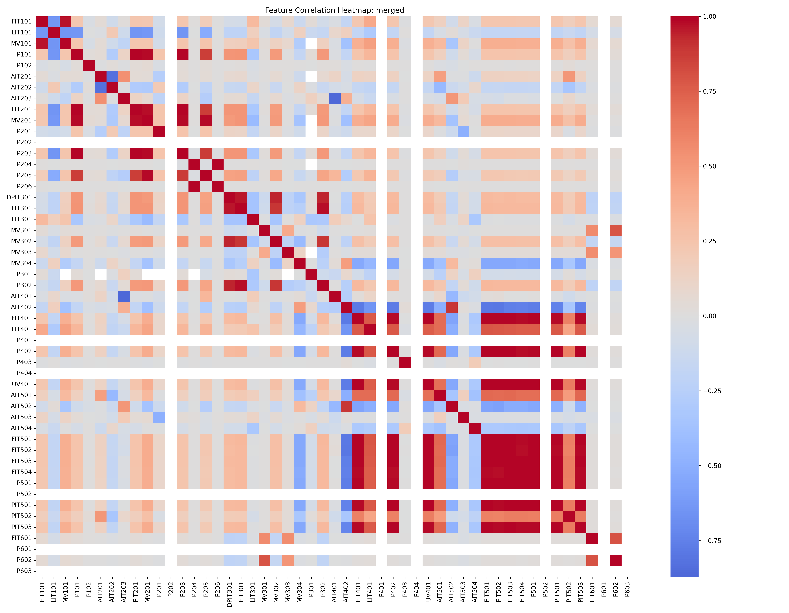
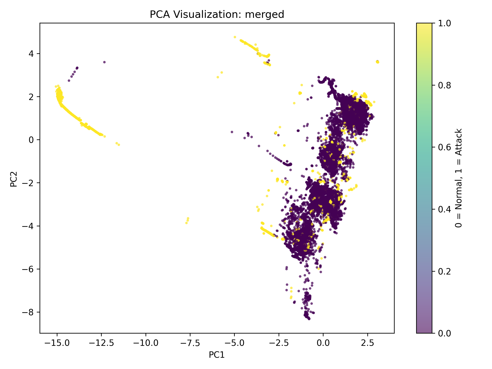
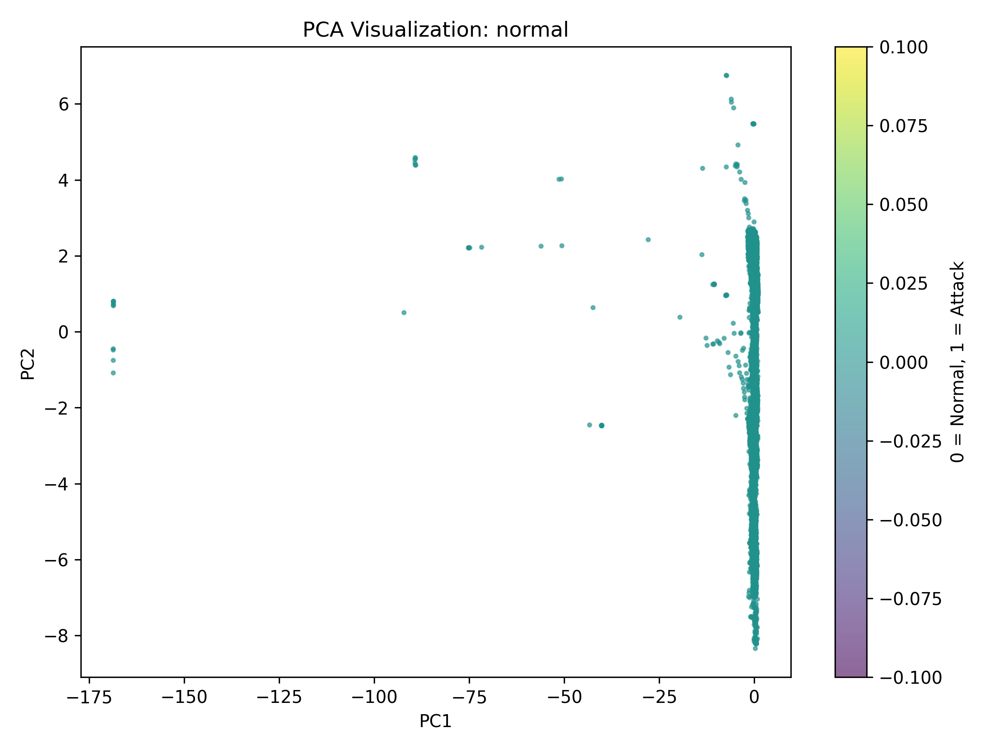
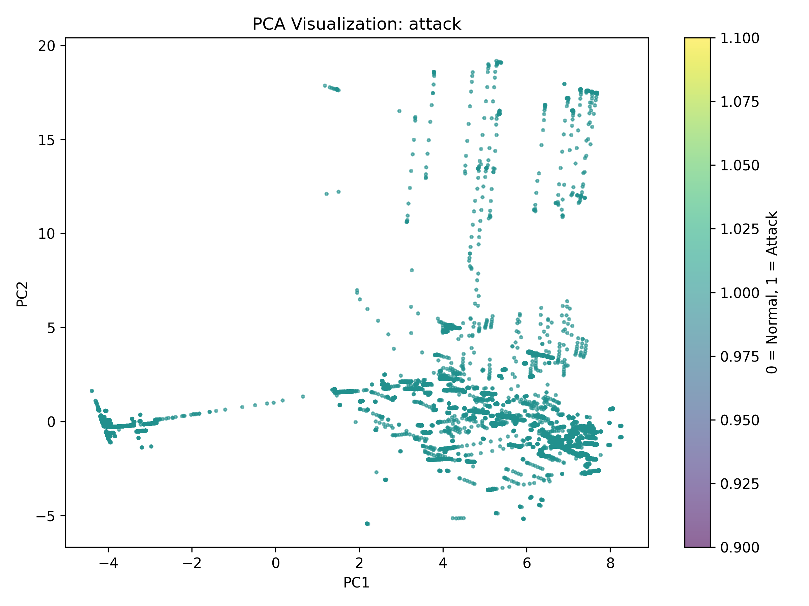
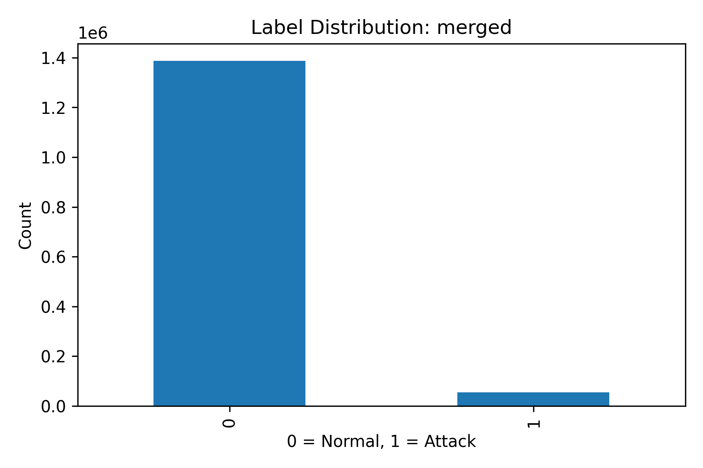
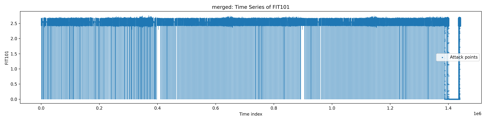
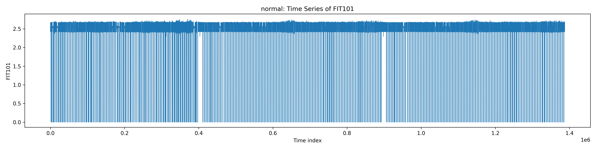
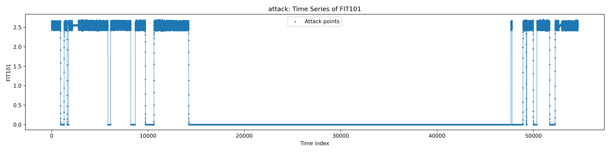

# Dataset Analysis

This directory contains the exploratory data analysis generated for the SWaT dataset before DT-RAVLA model training. The outputs summarize dataset structure, data quality, feature statistics, correlations, dimensionality reduction, sensor behaviour, and a classical Isolation Forest baseline.

The analysis is provided for three data partitions:

- **merged** – complete dataset containing normal and attack records
- **normal** – normal operating data only
- **attack** – attack records only

---

# Directory Structure

```text
DatasetAnalysis/
│
├── analysis_summary.json
│
├── merged_*
├── normal_*
├── attack_*
│
├── *.csv
├── *.json
├── *.png
└── README.md
```

---

# Dataset Summary

| Dataset | Rows | Columns | Numeric Features |
|---------|------:|---------:|----------------:|
| Merged | 1,441,719 | 54 | 51 |
| Normal | 1,387,098 | 54 | 51 |
| Attack | 54,621 | 54 | 51 |

The exported analysis reports describe the original `Normal/Attack` field together with the derived `binary_label` used during preprocessing. The dataset summary records the retained numeric variables after feature screening. 

---

# Analysis Outputs

## Dataset Information

The following JSON files summarize each dataset.

| File | Description |
|------|-------------|
| analysis_summary.json | Overall dataset summary |
| merged_basic_info.json | Combined dataset information |
| normal_basic_info.json | Normal data summary |
| attack_basic_info.json | Attack data summary |

Each file contains

- dataset dimensions
- column names
- numeric feature count
- label information
- duplicate rows
- missing values
- label distribution

GitHub renders JSON files directly in the browser.

---

# Descriptive Statistics

Files

```text
merged_descriptive_statistics.csv
normal_descriptive_statistics.csv
attack_descriptive_statistics.csv
```

These files contain

- mean
- median
- standard deviation
- minimum
- maximum
- quartiles
- skewness
- kurtosis

for every retained sensor.

---

# Correlation Analysis

Files

```text
merged_correlation_matrix.csv
normal_correlation_matrix.csv
attack_correlation_matrix.csv
```

Visualizations

```text
merged_correlation_heatmap.png
normal_correlation_heatmap.png
attack_correlation_heatmap.png
```

Example

```markdown

```

The heatmaps visualize pairwise Pearson correlations between retained process variables.

---

# Principal Component Analysis

Files

```text
merged_pca.png
normal_pca.png
attack_pca.png
```

GitHub automatically displays these images.

Example

```markdown
## Merged Dataset



## Normal Dataset



## Attack Dataset


```

The explained variance is stored in

```text
merged_pca_explained_variance.json
normal_pca_explained_variance.json
attack_pca_explained_variance.json
```

Summary

| Dataset | PC1 | PC2 | Total |
|---------|----:|----:|------:|
| Merged | 40.78% | 10.96% | 51.74% |
| Normal | 19.23% | 16.72% | 35.95% |
| Attack | 55.58% | 6.71% | 62.29% |

These values describe the variance captured by the first two principal components.   

---

# Label Distribution

Files

```text
merged_label_distribution.png
normal_label_distribution.png
attack_label_distribution.png
```

Example

```markdown

```

These figures visualize the class distribution before model training.

---

# Missing Values

Files

```text
merged_missing_values.png
normal_missing_values.png
```

These plots illustrate the location of missing observations across the dataset.

---

# Isolation Forest Baseline

Files

```text
merged_isolation_forest_report.json
normal_isolation_forest_report.json
attack_isolation_forest_report.json
```

Confusion matrices

```text
merged_isolation_forest_confusion_matrix.csv
normal_isolation_forest_confusion_matrix.csv
attack_isolation_forest_confusion_matrix.csv
```

The Isolation Forest results provide a classical anomaly-detection baseline for comparison with DT-RAVLA.

---

# Time-Series Visualizations

Representative sensor plots are provided for multiple process variables.

Available sensors include

- FIT101
- FIT201
- LIT101
- MV101
- MV201
- AIT201
- AIT202
- AIT203
- P101
- P102
- P201
- P202

Example

```markdown
## FIT101

### Merged



### Normal



### Attack


```

GitHub renders every PNG directly inside the repository.

---

# CSV Files

| File Pattern | Description |
|--------------|-------------|
| *_descriptive_statistics.csv | Sensor statistics |
| *_correlation_matrix.csv | Pearson correlation matrix |
| *_head_1000.csv | First 1,000 records |
| *_isolation_forest_confusion_matrix.csv | Confusion matrix |

These files can be opened directly in

- Microsoft Excel
- LibreOffice Calc
- pandas
- MATLAB
- R

---

# JSON Files

The JSON files contain structured metadata and can be viewed directly on GitHub.

Typical contents include

- dataset dimensions
- retained features
- label distributions
- PCA explained variance
- Isolation Forest reports
- graph configuration

---

# Viewing Figures on GitHub

GitHub automatically previews every PNG.

Simply click any image file such as

```
merged_pca.png
```

or

```
merged_correlation_heatmap.png
```

to view it in full resolution.

---

# Regenerating the Analysis

From the repository root

```bash
cd Code

python 01_swat_dataset_analysis.py
```

The script recreates every JSON, CSV, and PNG contained in this directory.

---

# Notes

This folder contains exploratory data analysis only.

The model evaluation, robustness experiments, cross-process testing, and benchmark tables used in the DT-RAVLA paper are stored separately in the `Model-Results` directory.
