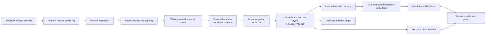

# DT-RAVLA

**DT-RAVLA: A Dual-Track Robust Attention-Based Variable-Sensor Learning Architecture for Industrial Cyberattack Detection**

DT-RAVLA is a compact temporal learning framework for anomaly detection in industrial control systems. The repository contains dataset analysis, model training, checkpoint evaluation, cross-process testing, robustness analysis, calibration, efficiency measurement, ablation support, and publication-ready table and figure generation for the SWaT and WADI datasets.

The implementation converts each multivariate process record into an **18-dimensional semantic token**, groups tokens into temporal windows, and processes each window with a shared Transformer encoder. This design keeps the neural input dimension fixed even when the source datasets contain different numbers of process variables.

---

## Main features

- SWaT and WADI dataset inspection and diagnostics
- Automatic numeric feature screening and label normalization
- Median imputation, robust scaling, and bounded clipping
- Sensor-count-independent 18-dimensional semantic tokenization
- Temporal windows of 64 samples with stride 8
- Three-layer Transformer encoder with four attention heads
- Learned temporal attention pooling
- Attack-probability and reconstruction-based decision paths
- Five-seed evaluation using seeds `42, 52, 62, 72, 82`
- Validation-only threshold selection
- SWaT-to-WADI cross-process testing
- Robustness tests for noise, missing values, frozen dimensions, bias, and temporal jitter
- Model size, latency, and throughput measurement
- CSV, JSON, LaTeX, PNG, and PDF result export
- Strict ablation policy using separately trained checkpoints

---

## Repository structure

```text
DT-RAVLA/
├── Code/
│   ├── 01_multi_dataset_analysis.py
│   ├── 01_swat_dataset_analysis.py
│   ├── aanalyze-sawt.py
│   ├── diagnose_wadi.py
│   ├── run_all.py
│   ├── evaluate_pretrained_all.py
│   ├── evaluate_pretrained_consistent_subtables.py
│   └── readme.md
├── Dataset/
│   ├── SWaT/
│   │   ├── merged.csv
│   │   ├── normal.csv
│   │   └── attack.csv
│   └── WADI/
│       ├── WADI_14days_new.csv
│       └── WADI_attackdataLABLE.csv
├── Results/
│   ├── models/
│   ├── tables/
│   ├── figures/
│   ├── diagnostics/
│   └── Reevaluation/
├── DatasetAnalysis/
├── Model-Results/
├── LICENSE
└── README.md
```

The training and evaluation scripts currently use:

```python
ROOT = Path(r"D:\other\DT-RAVLA")
```

Change this path in the scripts when your repository is stored elsewhere.

---

## Datasets

Download the datasets and place them in the directory structure shown above.

### SWaT

Kaggle source:

<https://www.kaggle.com/datasets/vishala28/swat-dataset-secure-water-treatment-system>

Expected main file:

```text
Dataset/SWaT/merged.csv
```

The code detects labels such as `Normal/Attack`, converts normal records to `0`, converts attack records to `1`, removes metadata fields, and retains valid non-constant numeric process variables.

### WADI

Kaggle source:

<https://www.kaggle.com/datasets/giovannimonco/wadi-data>

Expected files:

```text
Dataset/WADI/WADI_14days_new.csv
Dataset/WADI/WADI_attackdataLABLE.csv
```

The attack file is read with:

```python
WADI_ATTACK_HEADER = 1
WADI_LABEL_COLUMN = "Attack LABLE (1:No Attack, -1:Attack)"
```

The code maps WADI labels as follows:

```text
 1  -> normal
-1  -> attack
```

Because Kaggle archives may use slightly different filenames, confirm the extracted names before running the pipeline.

---

## Environment setup

### Option 1: Conda

Create a clean environment:

```bash
conda create -n dt-ravla python=3.11 -y
conda activate dt-ravla
```

Install PyTorch.

For an NVIDIA CUDA installation, use the command recommended for your CUDA version at the official PyTorch installer. A common CUDA 12.1 installation is:

```bash
pip install torch torchvision torchaudio --index-url https://download.pytorch.org/whl/cu121
```

For CPU-only execution:

```bash
pip install torch torchvision torchaudio
```

Install the remaining packages:

```bash
pip install numpy pandas scipy scikit-learn matplotlib seaborn joblib
```

Verify the environment:

```bash
python -c "import torch, pandas, sklearn, scipy; print('PyTorch:', torch.__version__); print('CUDA:', torch.cuda.is_available())"
```

### Option 2: Python virtual environment

Windows:

```bash
python -m venv .venv
.venv\Scripts\activate
python -m pip install --upgrade pip
pip install torch torchvision torchaudio
pip install numpy pandas scipy scikit-learn matplotlib seaborn joblib
```

Linux or macOS:

```bash
python3 -m venv .venv
source .venv/bin/activate
python -m pip install --upgrade pip
pip install torch torchvision torchaudio
pip install numpy pandas scipy scikit-learn matplotlib seaborn joblib
```

---

## Model architecture



### Semantic token

For each timestamp, the code computes:

```text
mean
standard deviation
minimum
maximum
median
mean absolute value
root mean square
positive-value ratio
negative-value ratio
zero-value ratio
5th percentile
10th percentile
25th percentile
50th percentile
75th percentile
90th percentile
95th percentile
mean adjacent absolute difference
```

This produces a fixed token dimension of `18`, independent of the original sensor count.

### Encoder configuration

```text
Token dimension:          18
Hidden dimension:         128
Window length:            64
Stride:                   8
Transformer layers:       3
Attention heads:          4
Feed-forward dimension:   512
Encoder dropout:          0.1
Head dropout:             0.2
Batch-first operation:    enabled
Attention pooling:        learned
```

---

## Running the project

Open a terminal in the `Code` directory:

```bash
cd Code
```

### 1. Inspect SWaT

```bash
python aanalyze-sawt.py
```

This script prints the SWaT shape, columns, data types, and sample records.

For the full SWaT analysis workflow:

```bash
python 01_swat_dataset_analysis.py
```

### 2. Inspect WADI

```bash
python diagnose_wadi.py
```

This checks possible header rows and helps verify the attack-label column.

### 3. Analyse both datasets

```bash
python 01_multi_dataset_analysis.py
```

This script creates dataset profiles, descriptive statistics, feature-quality reports, PCA plots, label distributions, and Isolation Forest baselines.

### 4. Train DT-RAVLA and generate base results

```bash
python run_all.py
```

The training script:

1. clears and recreates the `Results` directory;
2. loads and validates SWaT and WADI;
3. preserves temporal order within each class;
4. fits preprocessing statistics on training data;
5. generates semantic tokens and temporal windows;
6. trains Logistic Regression and Random Forest baselines;
7. trains DT-RAVLA for five seeds;
8. trains the reconstruction model on normal WADI windows;
9. runs the no-Transformer ablation;
10. saves checkpoints, tables, diagnostics, and result summaries.

Expected checkpoints:

```text
Results/models/SWaT_DT_RAVLA_seed42.pt
Results/models/SWaT_DT_RAVLA_seed52.pt
Results/models/SWaT_DT_RAVLA_seed62.pt
Results/models/SWaT_DT_RAVLA_seed72.pt
Results/models/SWaT_DT_RAVLA_seed82.pt

Results/models/WADI_DT_RAVLA_seed42.pt
Results/models/WADI_DT_RAVLA_seed52.pt
Results/models/WADI_DT_RAVLA_seed62.pt
Results/models/WADI_DT_RAVLA_seed72.pt
Results/models/WADI_DT_RAVLA_seed82.pt
```

The script automatically selects:

```python
DEVICE = torch.device("cuda" if torch.cuda.is_available() else "cpu")
```

A CUDA-capable GPU is recommended because the full dataset contains more than one million SWaT records and the pipeline evaluates several seeds and corruption conditions.

### 5. Evaluate saved checkpoints

Run the complete checkpoint evaluation:

```bash
python evaluate_pretrained_all.py
```

This script does not retrain the models. It recreates the preprocessing and temporal splits, selects thresholds on validation data, and evaluates:

- in-domain performance;
- SWaT-to-WADI transfer;
- controlled corruption;
- calibration;
- model size;
- latency;
- throughput;
- optional true ablations.

Results are written to:

```text
Results/Reevaluation/tables/
Results/Reevaluation/figures/
Results/Reevaluation/diagnostics/
```

### 6. Generate the paper-consistent tables

```bash
python evaluate_pretrained_consistent_subtables.py
```

This version uses the paper protocol:

- SWaT baselines and DT-RAVLA share one frozen benchmark protocol;
- WADI is used as the target process for cross-process evaluation;
- true ablations require separately trained checkpoints;
- robustness uses the threshold selected on clean validation data;
- one merged IEEE table with aligned subtables is exported.

Main LaTeX output:

```text
Results/Reevaluation/tables/Table_2_Comprehensive_Results_with_Subtables.tex
```

Add the following package to your paper preamble:

```latex
\usepackage{subcaption}
```

---

## True ablation checkpoints

The evaluator supports these optional checkpoints:

```text
SWaT_No_Transformer_seed42.pt
SWaT_Mean_Pooling_seed42.pt
SWaT_No_Class_Weight_seed42.pt
SWaT_No_Robust_Scaling_seed42.pt
SWaT_No_Tokenisation_seed42.pt
```

Use the same naming pattern for all five seeds.

The evaluator excludes missing ablations and writes their availability to:

```text
Results/Reevaluation/diagnostics/ablation_checkpoint_availability.csv
```

A valid ablation must load a model trained with that configuration. Disabling a component only during testing does not provide a valid comparison.

---

## Evaluation protocol

The strict evaluator uses:

```text
Seeds:                         42, 52, 62, 72, 82
Window length:                 64
Stride:                        8
Maximum windows per split:     50,000
Evaluation batch size:         256
Threshold objective:           MCC
Maximum validation FPR:        0.01
Normal calibration quantile:   0.995
```

The robustness conditions are:

```text
Clean
Gaussian_5pct
Gaussian_10pct
Missing_10pct
Missing_20pct
Frozen_10pct
Bias_10pct
Temporal_Jitter
```

The evaluation code selects thresholds from validation data only. It does not use test labels to calibrate the final decision threshold.

---

## Output files

Typical outputs include:

```text
Results/
├── models/
│   ├── *.pt
│   └── *.joblib
├── tables/
│   ├── Table_2_Benchmark_Mean_Std.csv
│   ├── Table_3a_Ablation_Mean_Std.csv
│   ├── Table_3b_Cross_Dataset_Mean_Std.csv
│   └── Table_3c_Robustness_Mean_Std.csv
├── figures/
├── diagnostics/
│   └── data_protocol.json
└── Reevaluation/
    ├── tables/
    ├── figures/
    ├── diagnostics/
    └── evaluation_manifest.json
```

The exact files depend on the checkpoints available in `Results/models`.

---

## Reproducibility

Before reporting a result:

1. keep the dataset files unchanged;
2. record the exact dataset filenames and headers;
3. use the five configured seeds;
4. fit preprocessing statistics on training data only;
5. preserve the order of records inside each temporal window;
6. calibrate thresholds on validation data only;
7. keep the clean validation threshold fixed during corruption testing;
8. report missing ablation checkpoints instead of filling rows with estimated values;
9. retain `evaluation_manifest.json` and `data_protocol.json` with the final tables.

For a clean rerun:

```bash
conda activate dt-ravla
cd D:\other\DT-RAVLA\Code
python run_all.py
python evaluate_pretrained_all.py
python evaluate_pretrained_consistent_subtables.py
```

---

## Common issues

### `python: can't open file ...`

Confirm that you are inside the `Code` directory and use the exact filename:

```bash
cd D:\other\DT-RAVLA\Code
python run_all.py
```

### SWaT label column not found

Inspect the columns:

```bash
python aanalyze-sawt.py
```

The loader expects a label name equivalent to one of:

```text
Normal/Attack
label
attack_label
binary_label
```

### WADI label column not found

Run:

```bash
python diagnose_wadi.py
```

Confirm that:

```python
WADI_ATTACK_HEADER = 1
WADI_LABEL_COLUMN = "Attack LABLE (1:No Attack, -1:Attack)"
```

matches your file.

### CUDA is not detected

Check:

```bash
python -c "import torch; print(torch.cuda.is_available()); print(torch.version.cuda)"
```

If the result is `False`, reinstall PyTorch using the wheel that matches your NVIDIA driver and CUDA setup.

### Out-of-memory error

Reduce one or more of these values:

```python
BATCH_SIZE = 128
MAX_WINDOWS = 25000
```

Do not change the window length or stride when reproducing the reported protocol.

### Evaluation skips models

The evaluator only processes checkpoint files that exist in:

```text
Results/models/
```

Check the expected naming pattern and inspect:

```text
Results/Reevaluation/diagnostics/ablation_checkpoint_availability.csv
```

---

## Responsible use

DT-RAVLA is a research implementation. Do not connect the model directly to an actuator or automatic shutdown path without plant-specific validation. For operational use, combine model scores with process constraints, sensor-health checks, alarm persistence, and an incident review procedure. Recalibrate thresholds when the plant configuration, sensor inventory, or operating schedule changes.

---

## Citation

A formal paper citation can be added after publication. Until then, cite the repository:

```bibtex
@software{dt_ravla,
  author  = {Misha Urooj},
  title   = {DT-RAVLA: Dual-Temporal Resilient Variational Learning Architecture},
  year    = {2026},
  url     = {https://github.com/mishaurooj/DT-RAVLA}
}
```

---

## License

See the repository [`LICENSE`](LICENSE) file for the applicable terms.
